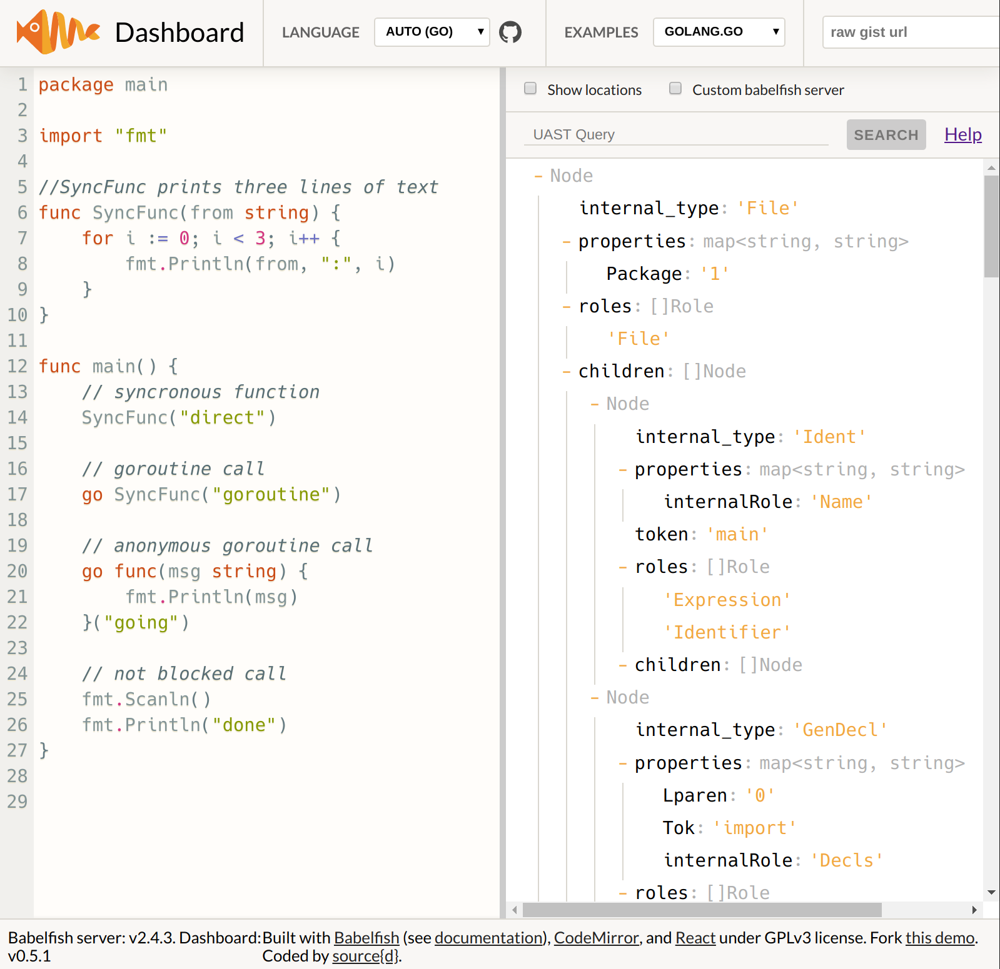
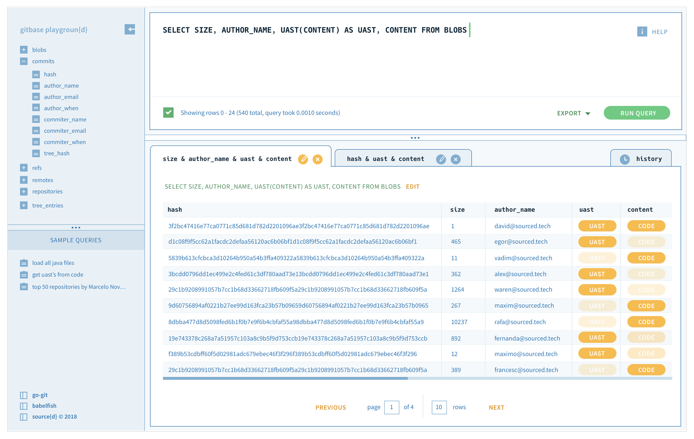

# Introduction to Code As Data & Machine Learning On Code

## Introduction

At source{d} we believe that Machine Learning on Code \(MLonCode\) will drastically change developer tooling as we know it. In particular, we expect that in the near future we'll see MLonCode powered tools in the areas of:

* Security & Compliance 
* QA & Testing 
* API Understanding 
* Bug Prediction/Detection
* Code Review/Quality

In this documentation we'll be talking about the different aspects of our technology stack and how you can get started with analyzing your source code as data and applying machine learning to it.

## Code as Data

### Introduction

To be able to do interesting analysis of source code, we need to treat our code as data. However, analyzing code as plain text is very limiting since our compilers actually use the [Abstract Syntax Tree](https://en.wikipedia.org/wiki/Abstract_syntax_tree) \(AST\).  

One of the main challenges you face when starting with source code as data, and in particular when doing so on top of AST's is that you end up with AST's from different programming languages and no way to query them in a language-agnostic manner. That's why we created [Babelfish](https://docs.sourced.tech/babelfish).

> **Babelfish is a self-hosted server for source code parsing.** The Babelfish service can parse any file, in any supported language, extracting an [Abstract Syntax Tree \(AST\)](https://en.wikipedia.org/wiki/Abstract_syntax_tree) from it and converting it into a [**Universal Abstract Syntax Tree \(UAST\)**](https://docs.sourced.tech/babelfish/uast/uast-specification).

### Getting started with Babelfish

* Check out the [documentation](https://docs.sourced.tech/babelfish)
* [Google Collab Notebook](https://colab.research.google.com/drive/1sHq2sIZqIpfoEdRSmAHb49ghbWFecuy-) where we extract all identifiers from a sample of Go code
* Checkout an [example](https://github.com/bblfsh/sonar-checks) of static analysis rules implemented on top of the UAST
* [Run babelfish server locally with docker](https://docs.sourced.tech/babelfish/using-babelfish/getting-started#installing-bblfshd-locally)
* Parse a sample of code at [http://dashboard.bblf.sh/](http://dashboard.bblf.sh/)

## Datasets

### Introduction

When working with machine learning on code \(MLonCode\) building your datasets is often time and resources intensive. We are lucky though that the field of MLonCode has very large amounts of public data available, it's all the public code hosted on GitHub, Bitbucket, Gitlab and equivalents. 

### Pubic Git Archive \(PGA\)

Public Git Archive is the result of months of effort curating a dataset suitable for training MLonCode models. The dataset contains 3TB of repositories from GitHub ready to download over HTTP. This includes all of the contents \(git metadata and file contents\) for all of the repositories on GitHub with 50 or more stars as of January 2018. This dataset also takes care of merging all git repositories that share a common root \(forks\). 

### Getting started with PGA

* Head over to the [documentation](https://docs.sourced.tech/datasets/publicgitarchive)
* Read the [announcement on our blog](https://blog.sourced.tech/post/announcing-pga/)
* Checkout the [GitHub repository](https://github.com/src-d/datasets/tree/master/PublicGitArchive)

### Building your own data retrieval pipeline

At source{d} we process 10s of millions of Git repositories, to be able to discover, process and efficiently store them, we created Rovers & Borges. This is the same pipeline that we use to build a dataset such as PGA. 

> **Rovers** is a service to retrieve repository URLs from multiple repository hosting providers, such as GitHub, BitBucket and cgit.

> **Borges** is a set of tools for the collection and storage of Git repositories at large scale. It is a distributed system, similar to what you may find in a search engine, that uses a custom repository storage[ file format](https://github.com/src-d/go-siva) and is optimized for saving storage space and keeping repositories up-to-date.

#### Getting started with Rovers & Borges

* Head over to the [Rovers](https://github.com/src-d/rovers) & [Borges repositories](https://github.com/src-d/borges)

## Analyzing Git Repositories

### Introduction

Some of the most valuable insights when analyzing source code come not just from its latest version in the current branch \([HEAD](https://git-scm.com/docs/gitglossary#gitglossary-aiddefheadahead)\) but from how the code has evolved over time. The evolution of code over time, often by multiple contributors, is where some of the most interesting analysis and data can be found. This means you have to work with the version control data, the most popular system for which is [git](https://git-scm.com/). To be able to make it easy for you to be able to analyze the version control history of git repositories, we created [gitbase](https://github.com/src-d/gitbase). 

> **gitbase**, is a SQL database interface to Git repositories. It can be used to perform SQL queries about the Git history and about the [Universal AST](https://doc.bblf.sh/) of the code itself. gitbase is being built to work on top of any number of git repositories. It implements the _MySQL_ wire protocol and can be accessed using any MySQL client/library from any language.

To make it easier to use Gitbase and in particular to integrate the visualizations of UAST's, we have created the gitbase web:

### Getting started with gitbase & gitbase web

* Check [the project's readme](https://github.com/src-d/gitbase-web#gitbase-web) to run it locally
* Head over to the [Gitbase documentation](https://docs.sourced.tech/gitbase)
* Checkout the GitHub repository for [Gitbase](https://github.com/src-d/gitbase) & [Gitbase web](https://github.com/src-d/gitbase-web)

## MLonCode Pre-Trained Models

### Introduction

When applying MLonCode, you usually find yourself wanting to train your own models on your private/proprietary code but also wanting to benefit from models that have been trained on very large datasets. At source{d} we are aware that not everyone can run an MLonCode pipeline over millions of repositories, therefore we are releasing pre-trained models.

### Getting started with MLonCode models

* Head over to the [documentation](https://docs.sourced.tech/models)
* Checkout the [GitHub repository](https://github.com/src-d/models)

## Training MLonCode Models

### Introduction

The sourced.ml library hosts the code that builds the pre-trained models that source{d} releases. It is designed to be an R&D library for ML engineers that abstracts the underlying stack. This is the right place to go to if you want to recreate one of our models on top of your own data. It is also the right place to go to in case you are building your own architectures and want to take advantage of the feature engineering that is already available to you via sourced.ml.

### Getting started with sourced.ml

* Head over to the [documentation](https://docs.sourced.tech/sourced-ml)
* Checkout the [GitHub repository](https://github.com/src-d/ml)

